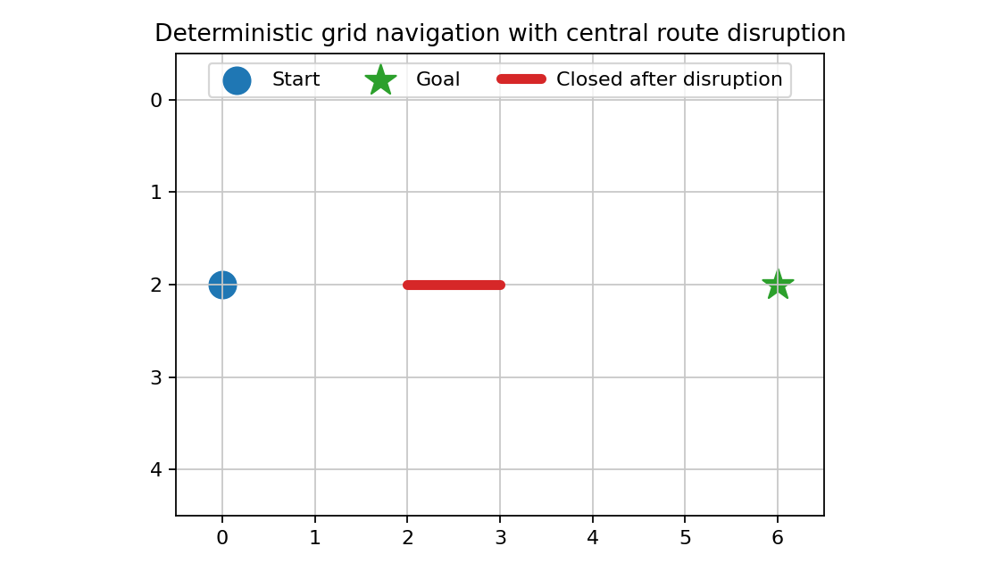
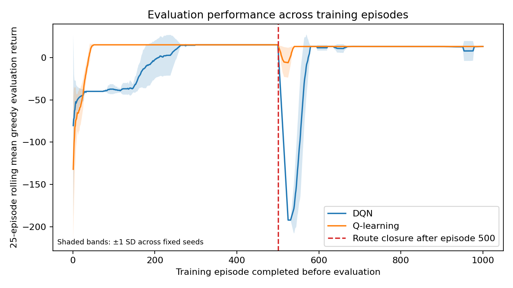
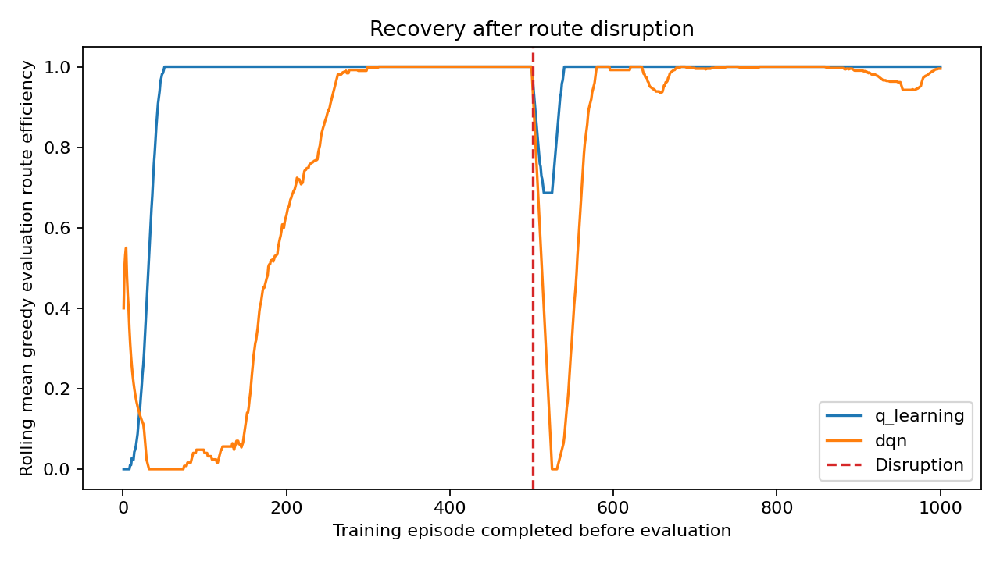
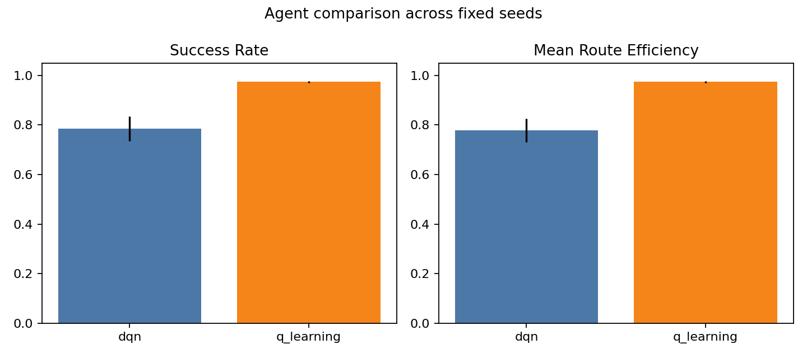

# Adaptive Urban Navigation with Reinforcement Learning under Route Disruptions

[](https://github.com/mohamad679/adaptive-urban-navigation-rl/actions/workflows/tests.yml)

This repository is a small, reproducible research benchmark for studying how reinforcement-learning agents adapt after an unexpected route closure in a simplified urban-navigation environment.

The project is deliberately modest: it is a deterministic computational benchmark, not a model of real human cognition or real urban mobility.

## At a Glance

- Deterministic `7 x 5` grid-navigation benchmark with a central route closure.
- Agents: tabular Q-learning and a small DQN baseline.
- Main experiment: five fixed seeds, `11, 22, 33, 44, 55`.
- Evaluation separates immediate zero-update post-disruption robustness from continued-learning recovery.
- Saved outputs include per-episode records, summaries, aggregate metrics, generated figures, and automated tests.

## Research Question

How quickly can reinforcement-learning agents adapt their navigation policy after an unexpected disruption in an urban environment?

## Motivation

Adaptive navigation is a useful setting for studying learning under changing environments. A controlled grid world makes the topology, rewards, optimal route, and disruption point explicit, so adaptation can be measured without relying on opaque simulation details.

## Environment

The environment is a deterministic two-dimensional grid with:

- state `(x_position, y_position)`
- actions `up`, `down`, `left`, `right`
- configurable start, goal, grid dimensions, blocked cells, and blocked route segments
- terminal goal state
- configurable rewards

Default rewards are:

- goal: `+20`
- ordinary movement: `-1`
- invalid movement or collision: `-5`

The default scenario is `central_route_closure`: the agent starts at `(0, 2)` and navigates to `(6, 2)` in a `7 x 5` grid. After episode 500 and before episode 501, the route segment between `(2, 2)` and `(3, 2)` is closed. The shortest path remains reachable but changes from length 6 to length 8.



*Figure 1. The marked road segment is available before disruption and closed after episode 500.*

## Baselines and RL Agents

The shortest-path oracle uses BFS. It is not a learned agent; it is used to verify reachability and compute optimal path length, route efficiency, and regret.

Implemented learning agents:

- tabular Q-learning
- small DQN with two 64-unit hidden layers, replay memory, target network, and epsilon-greedy exploration

Tabular Q-learning is implemented first because the environment has a small discrete state/action space and the method is interpretable.

## Experimental Design

The main experiment uses five fixed seeds:

`11, 22, 33, 44, 55`

The default benchmark configuration lives in `configs/default_experiment.json`. It defines the default seeds, episode schedule, recovery thresholds, step budget, and scenario. The runner reads this file by default.

Default schedule:

- episodes `1-500`: original environment
- after episode `500`: route closure is applied
- episodes `501-1000`: continued learning in the modified environment

After each training episode, the current policy is evaluated in a separate copied environment using greedy action selection and no learning updates. Reported metrics are computed from these evaluation episodes, not from exploratory training episodes.

Run the full experiment:

```bash
python3 scripts/run_experiments.py --include-dqn
```

## Evaluation Metrics

Required metrics are implemented in `src/evaluation/metrics.py`:

- success rate
- mean episodic return
- path length
- route efficiency
- recovery-window onset latency
- recovery-window confirmation latency
- cumulative regret

Failed episodes are handled explicitly:

- success is `False`
- path length is `None`
- route efficiency is `0`
- regret uses `max_steps_per_episode` as the realized route length

For successful episodes, path length is the number of actions taken to reach the goal, including any invalid actions made before success.

Immediate post-disruption robustness is evaluated once after the route closure is applied and before any post-disruption training update. It is a greedy no-update evaluation of the learned pre-disruption policy in the disrupted topology.

Recovery-window onset latency is defined before result interpretation: it is the number of post-disruption training episodes completed before the start of the first evaluation window whose following 25 episodes reach at least `0.8` success rate and at least `0.75` mean route efficiency. The first ordinary greedy evaluation after one post-disruption training episode has onset latency `1`, not `0`.

Recovery-window confirmation latency is the number of post-disruption training episodes completed by the end of that first qualifying recovery window.

Strong immediate post-disruption performance does not prove instant post-disruption learning. Epsilon-greedy exploration before disruption can already assign useful values to alternative routes that remain available after the closure.

## Results

The saved outputs in `results/metrics/` were generated by running:

```bash
python3 scripts/run_experiments.py --episodes 1000 --disruption-episode 500 --max-steps 40 --include-dqn
```

Aggregate measured results across the five fixed seeds:

| Agent | Success rate | Route efficiency | Episodic return | Path length | Cumulative regret |
| --- | ---: | ---: | ---: | ---: | ---: |
| Q-learning | 0.9740 | 0.97343 | 12.0428 | 7.0160 | 873.6 |
| DQN | 0.7848 | 0.77781 | -4.6916 | 7.2443 | 7291.6 |

Immediate post-disruption robustness:

| Agent | Immediate success rate | Immediate route efficiency |
| --- | ---: | ---: |
| Q-learning | 0.0 | 0.0 |
| DQN | 0.0 | 0.0 |

Continued-learning recovery:

| Agent | Recovery-window onset latency, mean +/- SD | Recovery-window confirmation latency, mean |
| --- | ---: | ---: |
| Q-learning | 5.8 +/- 4.38 | 29.8 |
| DQN | 38.8 +/- 8.79 | 62.8 |

Per-seed recovery-window onset latencies were `9, 9, 1, 1, 9` for Q-learning seeds `11, 22, 33, 44, 55`, respectively. For the DQN baseline used here, the corresponding latencies were `51, 35, 40, 41, 27`.

Across the five fixed seeds, both agents had 0% immediate post-disruption success. Under this fixed benchmark, neither learned pre-disruption greedy policy completed the disrupted route before post-disruption learning resumed, so recovery required continued post-disruption learning. Q-learning reached the predefined recovery-window onset earlier than the implemented DQN baseline across all five fixed seeds. These results do not imply general superiority of Q-learning over DQN.

## Figures

Generated from saved experiment outputs:

- `results/figures/figure_1_environment.png`
- `results/figures/figure_2_learning_curve.png`
- `results/figures/figure_3_recovery_after_disruption.png`
- `results/figures/figure_4_agent_comparison.png`



*Figure 2. Curves are 25-episode trailing rolling means of greedy evaluation return, computed separately per seed before aggregation; each line is the mean across five fixed seeds, shading is +/- 1 SD, and the disruption boundary is after episode 500.*



*Figure 3. Curves are 25-episode trailing rolling means of greedy route efficiency, computed separately per seed before aggregation; each line is the mean across five fixed seeds, shading is +/- 1 SD, and the disruption boundary is after episode 500.*



*Figure 4. Bars are means across the five fixed seeds, and error bars are sample standard deviations across seeds.*

## Reproducibility

The final verified experiment and test suite used Python `3.11.9` with the exact package versions pinned in `requirements.txt`:

- `matplotlib==3.9.4`
- `numpy==1.26.4`
- `pytest==8.3.5`
- `torch==2.2.0`

These pinned dependency versions are the versions used for the verified final experiment. Other Python or package versions are not verified for the reported results.

Compact reproducibility workflow:

```bash
python3 -m venv .venv
source .venv/bin/activate
python3 -m pip install -r requirements.txt
python3 -m pytest -q
python3 scripts/run_experiments.py --include-dqn
```

The test command verifies implementation behavior. The experiment command regenerates the benchmark outputs and figures if reproduction of the saved results is desired.

Use another compatible benchmark configuration with `--config PATH`. Explicit CLI overrides such as `--episodes`, `--disruption-episode`, and `--max-steps` take precedence over values loaded from the JSON file. Agent selection is intentionally controlled by the CLI: `--include-dqn` adds the DQN baseline.

Saved per-seed outputs include configuration, episode-level records, summaries, and aggregate metrics:

- `results/metrics/q_learning_seed_*/`
- `results/metrics/dqn_seed_*/`
- `results/metrics/aggregate_summary.json`

## Usage

Run the full test suite:

```bash
python3 -m pytest -q
```

Run Q-learning only:

```bash
python3 scripts/run_experiments.py
```

Run Q-learning with an alternate compatible configuration:

```bash
python3 scripts/run_experiments.py --config path/to/experiment.json
```

Run Q-learning and DQN:

```bash
python3 scripts/run_experiments.py --include-dqn
```

## Repository Structure

```text
adaptive-urban-navigation-rl/
├── .github/workflows/
├── configs/
├── results/
│   ├── figures/
│   └── metrics/
├── scripts/
├── src/
│   ├── agents/
│   ├── env/
│   ├── evaluation/
│   ├── training/
│   └── visualization/
├── tests/
├── LICENSE
├── PROJECT_BRIEF.md
├── README.md
├── pytest.ini
└── requirements.txt
```

## Key Findings

- The route disruption genuinely changes the navigation problem: the optimal route length increases from 6 to 8 while the goal remains reachable.
- Both agents had 0% immediate post-disruption success across the five fixed seeds.
- Under this fixed benchmark, neither pre-disruption greedy policy successfully completed the disrupted route before post-disruption learning resumed.
- Q-learning reached the recovery-window onset criterion after 5.8 episodes on average (SD 4.38), with per-seed onset latencies ranging from 1 to 9 episodes.
- The DQN baseline used here reached the recovery-window onset criterion after 38.8 episodes on average (SD 8.79), with per-seed onset latencies ranging from 27 to 51 episodes.
- Q-learning also had higher overall success and route efficiency and lower cumulative regret in this benchmark.

## Limitations

- The environment is one intentionally simple, deterministic grid.
- The benchmark uses one primary route-disruption topology.
- The main experiment uses five fixed seeds and one primary hyperparameter configuration per agent.
- The DQN baseline is intentionally small and not extensively tuned.
- Recovery latency depends on the predefined recovery window and thresholds.
- Results should not be interpreted as evidence about real human navigation.
- Behavioural mechanisms such as stochastic choice or route familiarity are not validated cognitive models.
- No favourable seed selection was performed; all required seeds are reported.

## Citation

This repository provides `CITATION.cff` so GitHub and citation tools can generate citation metadata. Please use that file if you cite this software or benchmark.

## Future Research Directions

- Stochastic softmax action selection as a behavioural variability proxy
- Route familiarity through transition visit counts
- Partial observability after the core benchmark remains stable
- Additional route-disruption topologies
- Broader but preregistered hyperparameter comparisons
